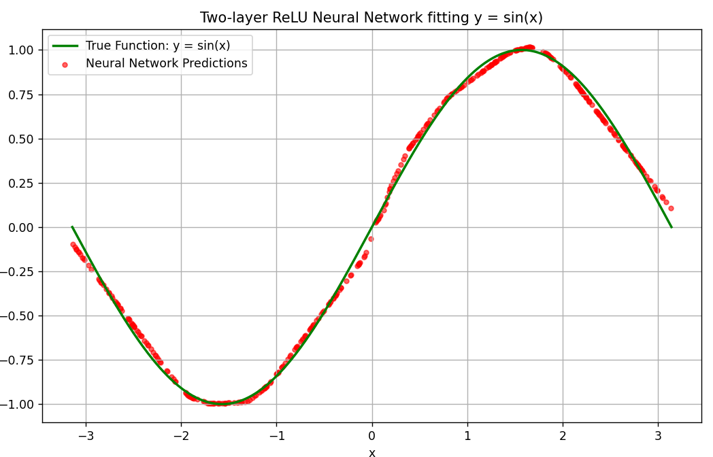

## 神经网络拟合 $y = \sin(x)$ 实验报告

### 1. 函数定义
本次实验选择拟合的经典周期函数为正弦函数：
$$y = \sin(x)$$
为了保证模型能够学习到该函数的完整非线性特征,包括波峰、波谷及过零点，定义输入变量 $x$ 的取值范围为一个完整的正弦周期 $[-\pi, \pi]$

### 2. 数据采集
* **样本生成**：使用 NumPy 在 $[-\pi, \pi]$ 区间内均匀采样了 2000 个数据点作为 $x$，并通过 $y = \sin(x)$ 计算出对应的真实标签 $y$
* **数据集划分**：为了客观验证模型的泛化能力，将这 2000 个样本随机打乱后，按照 80% 和 20% 的比例，划分为训练集 1600 个样本和测试集 400 个样本

### 3. 模型描述
根据万能近似定理，本次实验构建了一个两层的前馈神经网络,含一个隐藏层和一个输出层
* **网络结构**：
    * **输入层**：1 个神经元,接收 $x$ 值
    * **隐藏层**：采用 64 个神经元。激活函数选用 ReLU，其数学表达式为 $f(x) = \max(0, x)$。ReLU 能够为网络引入非线性，从而具备拟合任意复杂函数的能力
    * **输出层**：1 个神经元，不使用激活函数,即线性输出，直接输出预测的 $y$ 值
* **损失函数**：采用均方误差 MSE 来衡量预测值与真实值之间的差异
* **优化算法**：使用标准的梯度下降法,为了获取附加分，本实验完全依靠 NumPy 进行矩阵运算，手动推导并编写了网络的反向传播过程来更新权重和偏置

### 4. 拟合效果
经过多次迭代训练后，模型在训练集和测试集上的均方误差 MSE 均显著下降并趋于平稳,达到 0.001 级别的极低误差。将测试集的预测结果与真实正弦曲线绘制在同一张图表上可以直观地看到，模型预测的散点高度贴合真实的 $y = \sin(x)$ 曲线，成功证明了两层 ReLU 网络对非线性连续函数的强大拟合与模拟能力。

---

