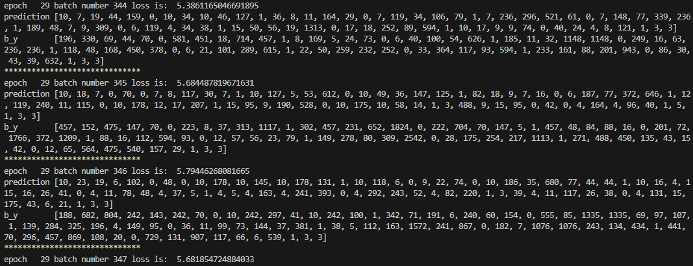
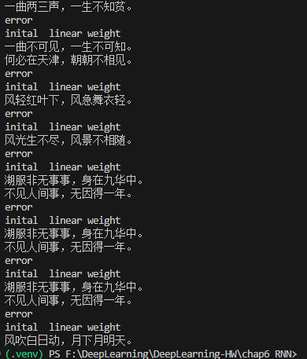

# 深度学习作业报告（RNN 诗歌生成，PyTorch 版本）

## 2. RNN、LSTM、GRU 模型解释

### 2.1 RNN
RNN 通过循环连接处理序列数据。在时间步 $t$，它将当前输入 $x_t$ 与上一步隐藏状态 $h_{t-1}$ 一起计算新的隐藏状态：

$$
h_t = \phi(W_x x_t + W_h h_{t-1} + b)
$$

其中 $\phi$ 常用 `tanh` 或 `ReLU`。RNN 的优点是能建模上下文依赖；缺点是长序列训练时容易出现梯度消失/爆炸，难以记住长期信息。

### 2.2 LSTM
LSTM 在 RNN 基础上引入“门控机制”和“细胞状态” $c_t$，缓解长期依赖问题。核心包含遗忘门、输入门、输出门：

$$
f_t = \sigma(W_f [h_{t-1}, x_t] + b_f)
$$
$$
i_t = \sigma(W_i [h_{t-1}, x_t] + b_i),\quad \tilde{c}_t = \tanh(W_c [h_{t-1}, x_t] + b_c)
$$
$$
c_t = f_t \odot c_{t-1} + i_t \odot \tilde{c}_t
$$
$$
o_t = \sigma(W_o [h_{t-1}, x_t] + b_o),\quad h_t = o_t \odot \tanh(c_t)
$$

由于细胞状态有“近线性通路”，LSTM 通常比普通 RNN 更稳定，适合语言建模与文本生成。

### 2.3 GRU
GRU 是 LSTM 的简化版本，将遗忘门与输入门融合为更新门，参数更少、训练更快。典型形式：

$$
z_t = \sigma(W_z [h_{t-1}, x_t])
$$
$$
r_t = \sigma(W_r [h_{t-1}, x_t])
$$
$$
\tilde{h}_t = \tanh(W_h [r_t \odot h_{t-1}, x_t])
$$
$$
h_t = (1-z_t) \odot h_{t-1} + z_t \odot \tilde{h}_t
$$

GRU 与 LSTM 效果通常接近；在数据量或算力较有限时，GRU 有时更具性价比。

---

## 3. 诗歌生成过程叙述

本实验整体流程如下：

1. **数据读取与清洗**
   - 从 `poems.txt` 读取诗句，过滤异常符号与过短/过长文本。
   - 每首诗添加起始标记 `G`（start token）与结束标记 `E`（end token）。

2. **构建词表与数字化**
   - 统计字频并构造 `word -> id` 映射。
   - 将每首诗转成 id 序列，如 `[G, 今, 夜, ... , E] -> [12, 530, 87, ..., 3]`。

3. **构造训练样本**
   - 输入序列 `x`：原序列去掉最后一个字。
   - 标签序列 `y`：原序列左移一位（下一个字预测）。
   - 即“语言模型”训练方式：给定前文预测下一个字。

4. **模型前向**
   - `Embedding` 将字 id 转为稠密向量。
   - 两层 `LSTM` 提取上下文时序特征。
   - `Linear + LogSoftmax` 输出每个时间步的词表概率分布。

5. **损失与优化**
   - 使用 `NLLLoss` 计算预测分布与真实下一个字之间的损失。
   - 使用 `RMSprop` 更新参数；使用梯度裁剪抑制梯度爆炸。

6. **生成阶段（给定 begin word）**
   - 以给定开头字作为起点。
   - 每步将当前序列送入模型，取最后一步输出概率最大的字作为下一个字。
   - 循环直到生成结束标记 `E` 或达到最大长度。

---

## 4. 生成结果与截图

> 题目要求 begin word：`日、红、山、夜、湖、海、月`

### 4.1 训练截图（必需）
- 请在此处粘贴训练日志截图（包含 `prediction / b_y / loss`）
其中error是数据行格式过滤日志，不是程序异常

### 4.2 生成结果截图（必需）
- 请在此处粘贴以 `日、红、山、夜、湖、海、月` 为开头词的生成结果截图

---

## 5. 实验总结

1. **模型行为**
   - 训练初期 loss 较高且输出重复 token 较多，属于正常现象。
   - 随着训练推进，模型逐步学习常见词搭配与句式结构，loss 下降后可生成更连贯文本。

2. **关键经验**
   - 序列任务中，LSTM 相比普通 RNN 更稳定，长期依赖建模能力更好。
   - 梯度裁剪对稳定训练非常重要，能有效缓解梯度爆炸。
   - 词表、数据清洗策略会显著影响生成质量。

3. **不足与改进方向**
   - 当前使用贪心解码，多样性有限；可改为温度采样或 top-k/top-p 采样。
   - 可加入验证集评估、学习率调度、保存最佳模型等机制。
   - 可尝试 GRU、双向结构或 Transformer 进行对比实验。

---

